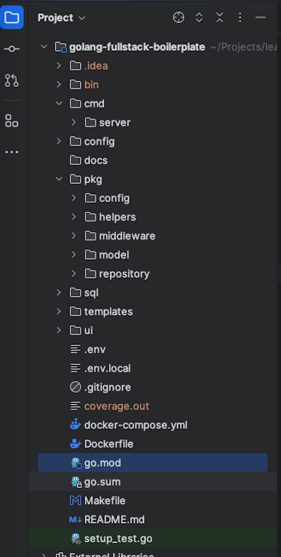

# golang-fullstack-boilerplate

This repository is a fullstack golang sample project. This repo includes Golang along with postgres database and Lit
element as UI framework. This is going to be awesome!!

## TODO

- Update readme
- Unit and integration test along with test architecture
- singleton
- Sample Todo working app with test sample.

## Project Structure



- [cmd](cmd) : Common commands, CLI Executables
- [cmd/server](cmd/server): App Server entry-point
- [config](config) : App configurations based on AppMode
- [docs](docs): Docs related files
- [pkg/config](pkg/config): Common Application Config module
- [pkg/helpers](pkg/helpers): Common helpers
- [pkg/middleware](pkg/middleware): Middleware for Http servers
- [pkg/model](pkg/model): Database/Json entities
- [pkg/repository](pkg/repository): Database repositories
- [sql](sql): SQL init scripts
- [templates](templates): Application templates
- [ui](ui): UI static files

## How to create multiple ENV files

Navigate to [env](pkg/env) folder and create files pattern application.{APP_MODE}.env
Here {APP_MODE} is different profile.

## Setup docker

```bash
docker compose up
```

## How to run

1. Local

    ```bash
    go run ./cmd/server
    ```

2. Prod other env

    ```bash
    APP_MODE={env} go run ./cmd/server
    
    ## Example prod
    APP_MODE=prod go run ./cmd/server
    ```

3. Using `make` command

    ```bash
    make run
    
    ## Dev mode
    make dev
    
    ```

## How to set logger

You can set diff log level using env variable `LOG_LEVEL={debug,info,warn,error}`  in environment
files[application.env](application.env). The default is `LOG_LEVEL=info`.

```properties
APP_VERSION=1.0.0
LOG_LEVEL=error
```

## Setup postgres database
To  run application, You need to run postgres database. You can easily do that using postgres

```bash
docker-compose up --build -d 
```

## Useful docker command

```bash
docker-compose up --build -d 

docker compose stop
docker compose rm -f
docker exec -it 4c0f5f4acb0c /bin/sh 
```